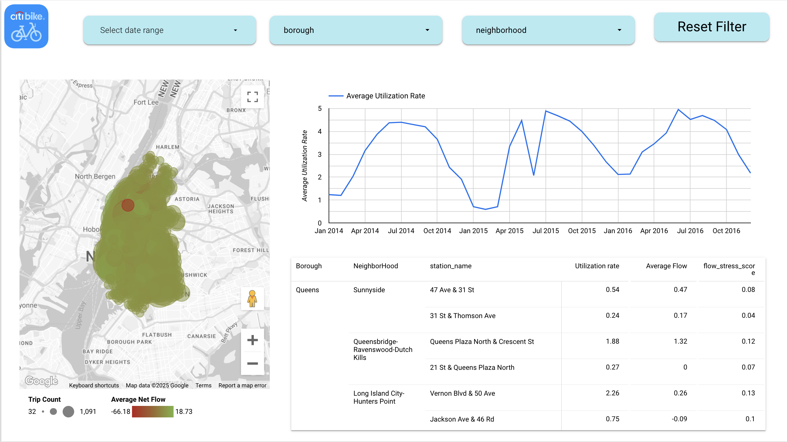

# Cyclistic Business Intelligence Analyst

## Project Overview
This repository contains documents and resources related to the **Cyclistic Business Intelligence Analyst** project. The project focuses on analyzing customer usage patterns for **Cyclistic**, a fictional bike-share company in **New York City**.

## Available Documents
- [**Cyclistic_Follow_Up_Question.pdf**](Documents/Cyclistic_follow_up_question.pdf): Contains follow-up questions and clarifications for the project.
- [**Cyclistic_Project_Requirements.pdf**](Documents/Cyclistic_Project_Requirements.pdf): Details the project scope, deliverables, and success criteria.
- [**Cyclistic_Stakeholder_Requirements.pdf**](Documents/Cyclistic_Stakeholder_Requirements.pdf): Outlines the key stakeholders and their expectations.
- [**Cyclistic_Strategy_Document.pdf**](Documents/Cyclistic_Strategy_Document.pdf): Provides strategic insights for customer growth and station expansion.


## 📊 Cyclistic Business Intelligence Report Summary

This section summarizes the three key pages of the NYC Citibike dashboard report, with visuals and detailed breakdowns to guide business insights and analysis.

---

### 📄 Page 1: Start Location Analysis


This page provides a detailed view of **trip activity by start station**, focusing on trip volume and duration across **New York City**. It distinguishes usage between **Subscribers** and **Customers**, highlighting differences in volume and trip time.

#### Key Features:
- **Map visualization**: Blue circles represent trip density per station.
- **Tabular summary**: Breakdown by borough and neighborhood with:
  - Number of trips
  - Average trip duration (Subscribers vs Customers)

#### Interactive Filters:
- **Date range**
- **Time of Day**
- **Season**
- **User Type**
- **Start Neighborhood**

This page helps identify high-volume pickup areas and typical trip lengths based on user segments.

---

### 📄 Page 2: Start–Destination Flow & Congestion


This page analyzes trips as **start-to-destination pairs** at both **station** and **neighborhood** levels. It quantifies usage patterns and **trip congestion** via average speed.

#### Key Features:
- **Top Destination Neighborhoods**: Ranked by trip count (e.g., Chelsea-Hudson Yards, East Village).
- **Station-to-Station Flows**: Lists route pairs with:
  - Start & destination station
  - Neighborhood pairing
  - Number of trips
  - **Average speed (km/h)** — used as a congestion indicator

#### Interactive Filters:
- **Date Range**
- **Time of Day**
- **Season**
- **Start/Destination Neighborhood**
- **Rain Condition**

This section is ideal for identifying commuting patterns, high-demand travel corridors, and potentially congested routes.

---

### 📄 Page 3: Station Utilization & Net Flow Analysis



This page highlights **station performance health** by visualizing two operational KPIs:
- **Utilization Rate**: How intensively stations are used compared to their capacity.
- **Net Flow**: The balance between trips started and ended at each station.

---

#### Part 1: Utilization Rate Over Time
- A **line chart** shows the **average utilization rate** across the network from **Jan 2014 to Dec 2016**.
- Utilization is defined as:

  ```
  Utilization Rate = (Trips Started + Trips Ended) / Capacity
  ```

- Seasonal trends are clearly visible, with peaks typically in spring and summer months.
- A higher rate suggests **higher infrastructure pressure** on docking stations.

---

#### Part 2: Station-Level Net Flow Map
- The **interactive map** shows each station as a bubble:
  - **Color** = Average Net Flow (green = surplus, red = shortage)
  - **Size** = Trip Count
- Enables geographic identification of **bike surplus/shortage zones**.

---

#### 📊 Sample Metrics Table

| Borough | Neighborhood | Station Name                    | Utilization Rate | Average Flow | Flow Stress Score |
|---------|--------------|----------------------------------|------------------|---------------|--------------------|
| Queens  | Sunnyside    | 47 Ave & 31 St                  | 0.54             | 0.47          | 0.08               |
| Queens  | Dutch Kills  | Queens Plaza N & Crescent St    | 1.88             | 1.32          | 0.12               |
| Queens  | Hunters Point| Vernon Blvd & 50 Ave            | 2.26             | 0.26          | 0.13               |

- **Flow Stress Score** = `ABS(Net Flow) / Capacity`
  - A higher score indicates stations that may be **imbalanced relative to their size**.

---

#### 📌 Interpretation Table

| **Net Flow Value** | **Meaning**                                                                                     | **Potential Location Analysis**                                             |
|--------------------|-------------------------------------------------------------------------------------------------|------------------------------------------------------------------------------|
| `> 0`              | More trips **ended** than started → Indicates a **destination station**.<br>🟢 Potential **bike surplus**.             | Likely **residential areas**, **evening hotspots**, or **parks**.           |
| `< 0`              | More trips **started** than ended → Indicates an **origin station**.<br>🔴 Potential **bike shortage**.                | Common in **office zones**, **commuter hubs**, or **campuses**.             |
| `= 0`              | Balanced station usage → Equal inbound and outbound flow.<br>⚖️ **No imbalance**, efficient flow.                     | Typically found in **mixed-use areas**, like **downtowns** or **tourist areas**. |

---

#### 🎛️ Available Filters
- **Date Range**
- **Borough**
- **Neighborhood**
- **Time of Day**

This page is a powerful tool for identifying:
- **Overloaded or underused stations**
- **Geographic flow imbalances**
- **Seasonal pressure on infrastructure**

Ideal for **operational logistics**, **urban infrastructure teams**, and **strategic planning discussions**.


---

## Setup Instructions
This project is containerized using Docker and can be managed using `make`. Follow these steps to set up and run the environment.

### 1. **Build the Docker Environment**
```bash
make build          # Build the default Docker environment
make build-nc       # Build without cache
make build-progress # Build with detailed progress output
```

### 2. **Running the Project**
```bash
make run          # Start the Spark cluster
make run-d        # Start in detached mode
make run-scaled   # Start with scaled Spark workers (3 workers)
```

### 3. **Stopping the Environment**
```bash
make stop         # Stop the Spark cluster
make down         # Remove all containers and volumes
```

### 4. **Submitting Spark Jobs**
You can submit Spark jobs using:
```bash
make submit app=<script_name>.py
```

### 5. **Removing Results**
```bash
make rm-results  # Remove result files from `book_data/results/`
```

## Spark Applications

All Spark jobs are stored in the `spark_apps/` directory:

- [**bike_trips_parquet.py**](spark_apps/bike_trips_parquet.py)  
  **Purpose**: Loads and preprocesses bike trip data.  
  **Output**: Saves Parquet files to **GCS**, sets up an **external table** in **BigQuery**.

- [**get_weather.py**](spark_apps/get_weather.py)  
  **Purpose**: Collects and loads **weather data** into **BigQuery** for usage correlation analysis.

- [**station_location.py**](spark_apps/station_location.py)  
  **Purpose**: Aggregates **station metadata** and **location info**, uploads to **BigQuery** for spatial analysis.

Run any of them using:
```bash
make submit app=<script_name>.py
```

---

## Service Account Setup

To enable **Google Cloud BigQuery** integration, follow these steps:

1. **Place your Google Service Account key file in the `gcp/` directory:**
   ```bash
   mkdir -p gcp
   mv your-service-account.json gcp/
   ```

2. **Ensure the `docker-compose.yml` mounts the file correctly:**
   ```yaml
   volumes:
     - ./gcp:/opt/gcp
   environment:
     - GOOGLE_APPLICATION_CREDENTIALS=/opt/gcp/your-service-account.json
   ```

3. **Check if the file is accessible inside the container:**
   ```bash
   docker exec -it da-spark-master ls -l /opt/gcp
   ```

4. **Verify environment variables inside the container:**
   ```bash
   docker exec -it da-spark-master env | grep GOOGLE_APPLICATION_CREDENTIALS
   ```

   Expected output:
   ```
   GOOGLE_APPLICATION_CREDENTIALS=/opt/gcp/your-service-account.json
   ```

5. **Use the credentials in your Spark job:**
   ```python
   import os

   os.environ["GOOGLE_APPLICATION_CREDENTIALS"] = "/opt/gcp/your-service-account.json"
   ```

Your Spark cluster is now ready to interact with **Google Cloud BigQuery** for scalable ETL workflows. 🚴‍♂️☁️📊
